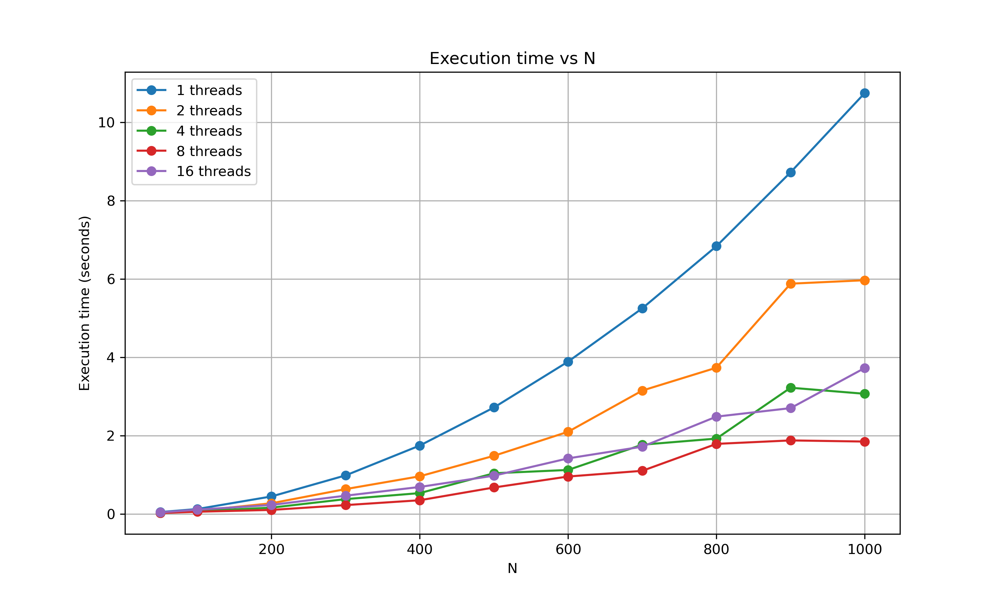
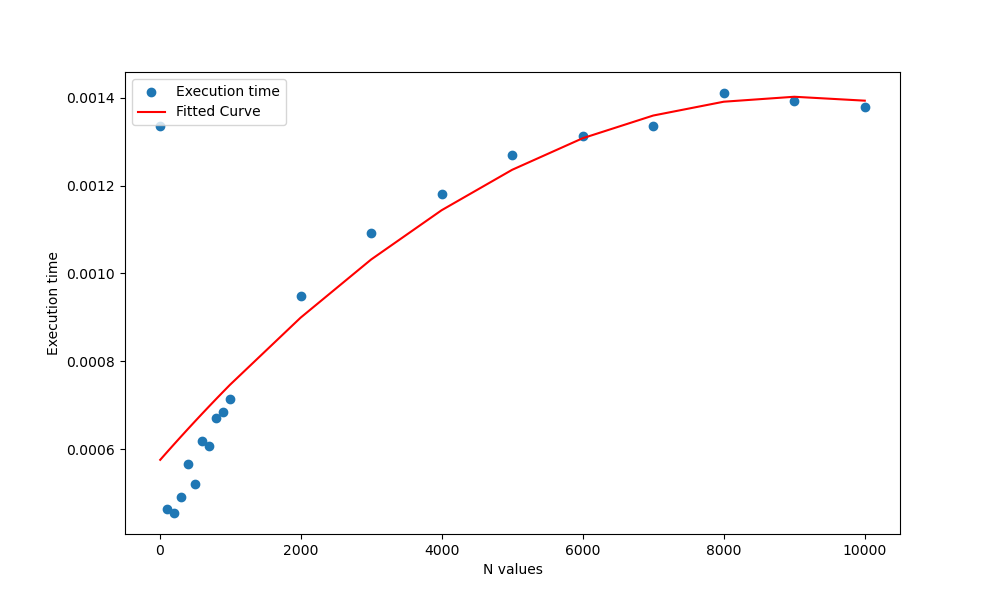

# N-Body Simulation: Low-Level Performance Engineering


A high-performance gravitational simulation engine demonstrating **cache-conscious programming** and **custom memory management**. This project optimizes the classic N-Body problem ($O(N^2)$) to $O(N \log N)$ using the Barnes-Hut algorithm, achieving **1.5M interactions/sec** on a single thread.

## ⚡️ Engineering Highlights

### 1. Zero-Overhead Memory Arena
Standard `malloc` is non-deterministic and slow for millions of small tree nodes. I implemented a **Linear Arena Allocator** that reduces allocation cost to a simple pointer increment.

**Benchmark Results (`scripts/bench_alloc.c`)**:
| Allocator | Time (10M Ops) | Speedup |
|-----------|---------------|---------|
| `malloc`/`free` | 1.0520s | 1x |
| **Arena (My Impl)** | **0.0022s** | **~478x** |

```c
// src/ds.h
typedef struct NodeArena {
  TNode *buffer;    // Contiguous memory block
  size_t used;      // Bump pointer
} NodeArena;
```

### 2. Cache Locality Optimization (Morton Codes)
Naive particle storage leads to random access patterns during tree traversal (Cache Misses).
*   **Solution**: Reordered particles using a **Z-Order Curve (Morton Code)**.
*   **Implementation**: Used 64-bit integer bit-interleaving (Magic Numbers) for $O(1)$ encoding.

```c
// src/morton.c: 64-bit Interleaving for Z-Order Curve
static inline uint64_t split_by_3(unsigned int a) {
    uint64_t x = a & 0x1fffff;
    x = (x | x << 32) & 0x1f00000000ffff; // ... Magic bit masks
    return x;
}
```

### 3. Parallelism & Load Balancing
*   **K-Means Clustering**: Pre-partitions the domain into $K$ clusters before simulation steps to ensure balanced workloads for OpenMP threads.
*   **Dynamic Scheduling**: `omp parallel for schedule(dynamic)` handles uneven tree depths.

## 📊 Performance Visuals

### Algorithmic Complexity
Comparison of Brute Force ($O(N^2)$) vs Barnes-Hut ($O(N \log N)$) execution time.
<p align="center">
  
</p>

### Accuracy vs Speed
Benchmarking error rates with different Theta ($\theta$) approximation thresholds.
<p align="center">
  
</p>

## 🛠️ Build & Experiment

```bash
# Build the highly optimized engine
mkdir build && cd build
cmake ..
make

# Run the memory benchmark yourself
./bench_alloc
```
