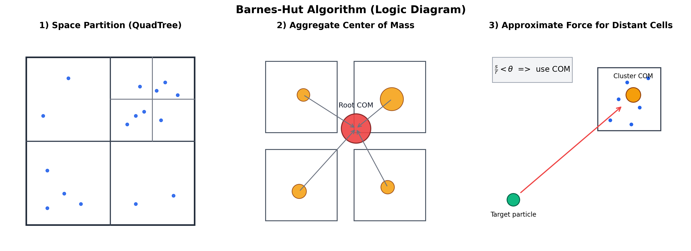

# N-Body Simulation Engine: Performance Optimization


This project optimizes an N-Body engine from a brute-force $O(N^2)$ baseline to a Barnes-Hut pipeline with arena allocation, Morton ordering, and OpenMP parallelization.
Final benchmarks were run on UPPMAX (`pelle`, 1 node, 36 CPUs). Earlier cloud measurements were useful for iteration, but the UPPMAX results are the reference data in this repository.

## Canonical Workflow

If you want to reproduce the final reported results, use this path:

1. Submit the UPPMAX job with `BENCHMARK_MODE=all`.
2. Treat these two files as the canonical outputs:
   - `data/metrics/uppmax_full_results.json`
   - `data/metrics/uppmax_ablation_results.json`
3. Re-generate the scaling plots from `data/metrics/uppmax_full_results.json` with:

```bash
python3 scripts/plot_scaling.py
```

Historical local and cloud measurements were useful during development, but they are not the reference results for this repository.

## Key Results

- **Algorithmic speedup**: on UPPMAX, v1 to v2 reduces runtime from `0.19s` to `0.02s` at $N=5,000$ and from `0.76s` to `0.06s` at $N=10,000$.
- **Memory/layout optimizations**: at $N=50,000$, v3 to v4 improves runtime from `0.36s` to `0.21s` (`1.71x`).
- **Parallel stage (v5)**: at $N=50,000$, v5 improves from `0.16s` at 1 thread to `0.04s` at 16 threads; at fixed $N=100k$, strong scaling reaches `4.0x` speedup at 16 threads.

### Scaling Observation

Multi-thread scaling is positive on UPPMAX, but still limited by the serial tree build and memory-access-heavy traversal.

In these measurements, algorithmic and locality improvements still account for a large share of the total gain, and the parallel stage provides an additional but sub-linear speedup.

How to read the scaling plots:
- **Strong scaling**: x-axis is thread count $P$; y-axis is speedup $T_1/T_P$ at fixed $N=100k$. The gap from the ideal line widens at higher $P$.
- **Weak scaling**: x-axis is thread count $P$; y-axis is efficiency. Workload size increases with threads ($N=100k\times P$), and the plotted adjusted efficiency accounts for $O(N\log N)$ work growth.
- **Observed trend**: Strong scaling is clearly positive up to 16 threads, while weak-scaling efficiency still decays as problem size and thread count grow together.


*Strong-scaling trend at $N=100k$ on UPPMAX: speedup reaches about `4.0x` at 16 threads, with the remaining gap to ideal scaling explained by serial tree construction and memory-bound traversal.*


*Weak-scaling trend (with $O(N\log N)$ adjustment): runtime grows from `0.36s` to `1.36s` as workload scales from `100k` to `1.6M`, indicating useful but non-ideal scaling.*

## Optimization Stages

Each stage addresses one observed bottleneck.

Archived Stage V (K-Means clustering) is documented in Ablation Notes and is disabled by default (`k=0`).

### Stage I: Barnes-Hut Algorithm
**Bottleneck**: $O(N^2)$ complexity makes even moderate problem sizes costly.
- **Solution**: Switch to **Barnes-Hut** ($O(N \log N)$) using QuadTree approximations.
- **Result**: on UPPMAX, $N=5,000$ drops from `0.19s` to `0.02s`, and $N=10,000$ drops from `0.76s` to `0.06s`. Accuracy remains consistent at $\theta=0.5$.


*Barnes-Hut logic: quadtree partitioning, center-of-mass aggregation, and far-field approximation using $s/r < \theta$.*

### Stage II: Linear Arena Allocator
**Bottleneck**: Per-node `malloc` calls scatter tree nodes across the heap, causing cache misses on pointer dereference.
- **Solution**: Pre-allocate a contiguous buffer; serve nodes from it with pointer-bump (Arena Allocator).
- **Result**: this stage prepares the tree for locality-sensitive improvements and remains part of the final pipeline.

### Stage III: Morton Sorting (Z-Order)
**Bottleneck**: Even with arena allocation, inserting particles in random order hurts spatial locality during tree construction and leaves nearby particles scattered in the backing arrays.
- **Solution**: Reorder particles by Morton code (Z-order curve) before tree insertion, so nearby particles are visited and inserted in a more locality-friendly order.
- **Result**: on UPPMAX at $N=50,000$, runtime improves from `0.36s` to `0.21s` over the arena baseline.

### Stage IV: Parallel with OpenMP
**Bottleneck**: Parallel efficiency is limited by uneven per-particle traversal cost and a still-mostly-serial tree build.
- **Solution**: Parallelize the force-compute loop with OpenMP and use `schedule(dynamic, 128)` to reduce idle time from dense vs. sparse workload imbalance.
- **Result**: on UPPMAX at $N=50,000$, runtime drops from `0.16s` at 1 thread to `0.04s` at 16 threads. At fixed $N=100k$, end-to-end strong scaling reaches `4.0x` at 16 threads.
- **Boundary**: End-to-end scaling remains capped because tree construction is still mostly serial, and traversal is branch-heavy/pointer-heavy with limited auto-vectorization in the hot path.
- **Environment note**: Results were measured on UPPMAX (`pelle`) and are more stable than the earlier shared-cloud measurements.

Further parallel optimization opportunities:
- Parallel tree construction (task-based or level-based build) to reduce the serial fraction.
- Scheduling sweep (`static` / `dynamic` / `guided` and chunk sizes) to balance overhead vs. load imbalance.
- Data-layout and traversal refactoring to improve cache behavior in the parallel force-compute path.

---

## Ablation Notes (What We Tried)

### 1. Geometric Clustering (K-Means)

Before Morton sorting, K-Means was tested to improve spatial locality before tree insertion.

**Measured result on UPPMAX** ($N=50,000$, 8 threads):

| Configuration          | Wall Time (avg 3 runs) | Force Compute | K-Means Overhead |
| :--------------------- | :--------------------- | :------------ | :--------------- |
| k=0 (Morton, no KM)    | `0.05s`                | `0.0094s`     | —                |
| k=32 (K-Means enabled) | `0.08s`                | `0.0152s`     | `0.0132s`        |

Result: K-Means increased total runtime by about `60%` on this UPPMAX test, and the added preprocessing cost was not offset by better traversal time. The implementation remains in `core/kmeans.c` as an experiment; runtime default is still `k=0` (disabled).
This ablation result was not retained in the default path: iterative clustering added measurable overhead, while Morton ordering remained the lower-overhead locality improvement.

### 2. Static vs. Dynamic Scheduling

Static scheduling assigned fixed particle ranges to threads. Dynamic scheduling was expected to help when per-particle traversal cost became imbalanced.

**Measured result on UPPMAX** (`N=100,000`, 16 threads, chunk size `128`):

| Configuration     | Wall Time | Force Compute | Tree Build |
| :---------------- | :-------- | :------------ | :--------- |
| `static,128`      | `0.09s`   | `0.0107s`     | `0.0221s`  |
| `dynamic,128`     | `0.09s`   | `0.0102s`     | `0.0221s`  |

Outcome: on this UPPMAX measurement, `static` and `dynamic` were effectively tied at end-to-end runtime, with only a small force-compute advantage for `dynamic`. `schedule(dynamic, 128)` remains the repository default, but this is now a conservative default choice rather than a strong claimed speedup.

---

## Numerical Integrity & Verification

1. **Numerical Parity Check**: At $\theta=0$, v1 and v5 show relative error $< 10^{-16}$.
2. **Precision choice**: Particle state is stored in `double`, which helps reduce accumulated numerical drift relative to `float` during longer runs.
3. **Stochastic Sampling**: For large $N$, `scripts/accuracy.py` randomly samples particle forces across versions to verify convergence within tolerance.
4. **Integrator choice**: Velocity Verlet was used as a stable and efficient baseline for this project.

Verification commands:
```bash
# smoke test
./build/nbody_simulate 5 128 data/inputs/smoke_128.gal 1 0.001 1 0.5 0

# compare two outputs
python3 scripts/accuracy.py data/ref_v1.gal data/result_v5.gal
```

---

## Project Infrastructure

### Structure
- `v1_naive.c` ... `v5_parallel.c`: Core evolution stages.
- `core/`: Shared infrastructure (QuadTree, Arena, IO).
- `data/inputs/`: Input and benchmark datasets.
- `data/outputs/`: Simulation outputs.
- `data/metrics/`: Structured benchmark summaries (`*.json`).
- `scripts/`: Diagnostic, verification, and visualization tools (`accuracy.py`, `benchmark_suite.py`, `benchmark_full_suite.py`, `benchmark_ablation.py`, `plot_scaling.py`, `plot_roofline.py`, `generate_data.py`).

### Build
```bash
mkdir -p build && cd build
cmake ..
cmake --build . -j
```

### Run
```bash
./build/nbody_simulate 5 100000 data/inputs/input_100k.gal 1 0.001 8 0.5 0
```

### Smoke Test
```bash
./build/nbody_simulate 5 128 data/inputs/smoke_128.gal 1 0.001 1 0.5 0
```

### UPPMAX Deployment
Sync the project to UPPMAX with `rsync`:
```bash
bash scripts/uppmax_sync.sh <user@host> <remote_dir>
```

On UPPMAX, submit the benchmark job from the project root:
```bash
sbatch -A <uppmax-account> scripts/uppmax_benchmark.sbatch
```

The batch job:
- builds a release binary in `build-uppmax/`
- generates any missing benchmark inputs
- runs the full diagnostic + scaling suite by default
- writes results to `data/metrics/uppmax_full_results.json`

For a step-by-step SSH and job-submission guide, see [`UPPMAX.md`](/Users/ymlin/Downloads/003-Study/137-Projects/05-nBody-Problem-Simulation/UPPMAX.md).
