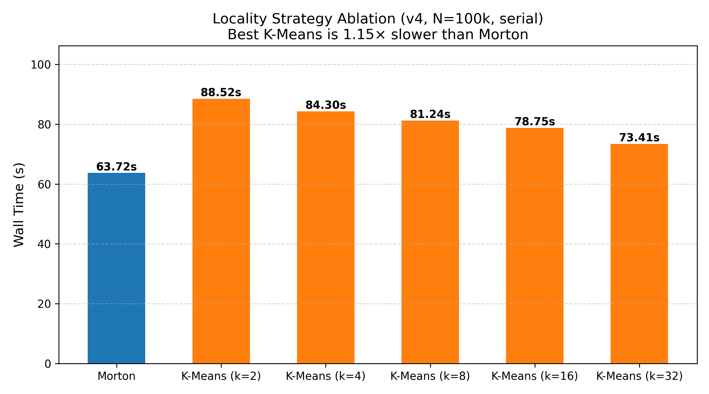

# N-Body Simulation in C

## 1. Introduction

This project implements a 2D gravitational N-body simulator in C and systematically evaluates performance across algorithmic, implementation, memory-locality, and parallelization optimizations.

## 2. Baseline and Algorithmic Improvement

### 2.1 Naive All-Pairs ([naive.c](/Users/ymlin/Downloads/003-Study/137-Projects/05-nBody-Problem-Simulation/naive.c))

The reference implementation. For every particle, it computes the gravitational contribution from every other particle directly. The time complexity is $\mathcal{O}(N^2)$. It provides an exact baseline for both runtime and accuracy.

### 2.2 Barnes-Hut Algorithm ([barnes_hut.c](/Users/ymlin/Downloads/003-Study/137-Projects/05-nBody-Problem-Simulation/barnes_hut.c))

Replaces the direct all-pairs computation with a Barnes-Hut quadtree. In 2D, the domain is recursively partitioned into quadrants. For each target particle, the tree is traversed recursively: if a cell is sufficiently far away relative to its size, as determined by the threshold $\theta$, the entire cell is treated as a single pseudo-particle located at its center of mass; otherwise, the traversal continues into that cell's children.

This reduces the computational complexity to $\mathcal{O}(N \log N)$ and gives the largest performance gain in the optimization pipeline.

<div align="center">
  
</div>

## 3. Implementation Refinements

### 3.1 Arena Allocation

Introduces arena allocation for tree nodes. The purpose is to replace repeated small heap allocations with a simpler contiguous allocation strategy. This reduces allocator overhead and makes node creation cheaper and more predictable.

### 3.2 Data Layout and Arithmetic Cleanup

The implementation also removes avoidable overhead inside the hot path by keeping particle attributes in compact shared arrays and hoisting loop-invariant quantities such as the global gravitational scaling factor out of the per-particle force loop.

### 3.3 Isolated Effect

On the saved serial benchmark at `N=10,000`, `nsteps=200`, `dt=1e-5`, and `theta=0.5`, adding arena allocation reduces median runtime from `11.06s` to `10.66s`, a modest `1.04x` improvement. This is consistent with an implementation-level refinement rather than a fundamental change in asymptotic work.

## 4. Locality Optimization

The next optimization targets memory behavior rather than arithmetic count. In this stage, two spatial-ordering strategies were considered for improving traversal locality: Morton ordering and a K-means-based clustering order. The goal was to compare them under the same Barnes-Hut pipeline and retain the better locality strategy in the main implementation.

### 4.1 Motivation

Barnes-Hut traverses the tree according to spatial relationships. If particles that are nearby in space are scattered in memory, traversal tends to touch memory with poor spatial locality, increasing cache misses and hurting throughput.

### 4.2 Candidate Strategies

The first candidate is Morton ordering. It maps nearby 2D positions to nearby 1D memory locations, improving cache behavior during tree construction and traversal without changing the underlying Barnes-Hut approximation.

The second candidate is a K-means-based clustering order, explored as an alternative locality strategy. Its intent is similar: place particles that are close in space closer together in memory. Unlike Morton ordering, however, it requires an additional clustering stage and only produces a flat partition, rather than a hierarchical space-filling ordering aligned with quadtree traversal.

### 4.3 Experimental Comparison

The locality ablation evaluates K-means across different cluster counts `k`. In practice, K-means performance depends on both `k` and the reclustering frequency; to limit overhead, reclustering is performed periodically rather than every timestep. In contrast, Morton ordering is recomputed every timestep.

The comparison is conducted at `N=100,000`, `nsteps=200`, `dt=1e-5`, `theta=0.5`, and `1` thread.

- Morton ordering: `63.73s` median runtime
- Best K-means variant (`k=32`): `73.41s`
- Smaller K-means partitions (`k=2–16`): `78.76–88.52s`

Morton ordering is selected as the default locality strategy under this parameterization. It outperforms all tested K-means configurations, with the best case still about `1.15x` slower. This difference reflects both effectiveness and overhead: Morton provides a low-cost, deterministic mapping by interleaving coordinate bits into a 1D order that preserves spatial locality, while K-means introduces clustering cost without improving traversal coherence. More fundamentally, Morton ordering follows the hierarchical structure of the quadtree, whereas K-means produces only a flat clustering. Morton is recomputed every timestep yet still outperforms periodically reclustered K-means, which highlights both the low overhead of the Morton remapping and the weak alignment of flat clustering with tree traversal.

<div align="center">
  
</div>

## 5. Parallelization

Shared-memory parallelism is added on top of the Morton-ordered Barnes-Hut implementation.

### 5.1 Parallel Force Computation

The force evaluation loop is parallelized with OpenMP. Each particle update is independent once the tree has been built, so this loop is the natural parallel region.

### 5.2 Load Balancing and Scheduling

The traversal cost per particle is not uniform because some particles encounter deeper or more irregular tree walks than others. For that reason, dynamic scheduling is used to reduce imbalance.

At `N=100,000`, `16` threads, and `theta=0.5`, the schedule ablation gives:

<div align="center">

| Schedule | Total runtime | Force phase |
| :------- | ------------: | ----------: |
| static,128 | $0.145\,\mathrm{s}$ | $0.0346\,\mathrm{s}$ |
| dynamic,128 | $0.13\,\mathrm{s}$ | $0.0294\,\mathrm{s}$ |
| guided,128 | $0.13\,\mathrm{s}$ | $0.0301\,\mathrm{s}$ |

</div>

Dynamic scheduling is retained because it matches the best end-to-end runtime and gives the lowest measured force-phase time.

### 5.3 Scaling Behavior

Strong scaling is measured at fixed `N=100,000`. Runtime drops from `0.66s` at `1` thread to `0.13s` at `16`, `20`, and `32` threads, for an end-to-end speedup of about `5.1x`. The force phase itself continues to shrink from `0.2931s` at `1` thread to `0.0250s` at `20` threads, but the tree phase stays nearly constant at about `0.0206s`. The remaining runtime comes from other non-parallel components not included in the hotspot breakdown, most notably Morton reordering, integration, and surrounding timestep overhead. The runtime plateau near `0.13s` therefore indicates an effective serial bottleneck of about `0.13 / 0.66 ≈ 20%` of total end-to-end runtime, which is consistent with tree construction, ordering, and other non-parallel work setting the scaling ceiling.

<div align="center">
  
</div>

Weak scaling increases the problem size roughly with thread count, from `N=100,000` at `1` thread to `N=3,200,000` at `32` threads. The force phase grows much more slowly than the tree phase for most of the sweep, which indicates that the parallel force loop remains effective while serial tree construction and ordering increasingly dominate total runtime. The weak-scaling behavior is therefore mixed: the parallel region scales reasonably, but the implementation does not maintain constant per-thread runtime as `N` grows because the serial preprocessing cost also grows with problem size.

<div align="center">
  
</div>

## 6. Experimental Evaluation

### 6.1 Experimental Setup

The repository includes saved measurements under `data/metrics/`, collected on the `autodl` platform recorded in those files. Unless otherwise noted, experiments keep the integrator and approximation settings fixed and vary only the optimization under study.

Common settings:

- integrator: Velocity Verlet
- default Barnes-Hut threshold: `theta = 0.5`
- timestep: `dt = 1e-5`
- thread counts for scaling: `1, 2, 4, 8, 16, 20, 32`

### 6.2 Performance Breakdown

For the serial comparison at `N=10,000`, `nsteps=200`, `dt=1e-5`, and $\theta = 0.5$, the implementation progression is:

<div align="center">

| Stage | Added optimization | Median runtime | Incremental effect |
| :---- | :----------------- | -------------: | -----------------: |
| naive | all-pairs baseline | $86.11\,\mathrm{s}$ | reference |
| Barnes-Hut | quadtree approximation | $11.06\,\mathrm{s}$ | $7.8\times$ faster |
| + arena allocation | reduced allocator overhead | $10.66\,\mathrm{s}$ | $1.04\times$ faster |
| + Morton ordering | improved cache locality | $5.13\,\mathrm{s}$ | $2.08\times$ faster |
| + OpenMP, $16$ threads* | parallel force loop | $0.13\,\mathrm{s}$ | $5.1\times$ vs. $1$-thread at $N = 100{,}000$ |

</div>

`*` The OpenMP row is taken from the strong-scaling experiment at `N=100,000`, whereas the serial rows above use `N=10,000`, so it is included as a parallel reference point rather than a directly comparable serial ablation.

These results show that asymptotic improvement dominates the early gain, while implementation and locality optimizations provide smaller but still meaningful refinements on top of the Barnes-Hut reduction. Relative to the naive baseline, the fully optimized serial implementation is about `16.8x` faster in this benchmark.

### 6.3 Accuracy Check

Accuracy is evaluated against the naive reference on the saved correctness benchmark at `N=2,000`, `nsteps=200`, and `dt=1e-5`.

<div align="center">

| $\theta$ | Max position error | Mean position error |
| :------: | -----------------: | ------------------: |
| $0$ | $1.11 \times 10^{-16}$ | $2.06 \times 10^{-19}$ |
| $0.2$ | $5.88 \times 10^{-9}$ | $8.38 \times 10^{-10}$ |
| $0.5$ | $7.18 \times 10^{-8}$ | $8.56 \times 10^{-9}$ |
| $1.0$ | $1.03 \times 10^{-5}$ | $6.46 \times 10^{-8}$ |

</div>

This establishes the expected trade-off: increasing `theta` improves performance by allowing more approximation, but error increases. The `theta = 0` result is effectively at floating-point rounding level, which confirms that the Barnes-Hut implementation matches the naive reference when approximation is disabled. In this dataset, particle coordinates are `O(1)`, so errors on the order of `1e-8` remain negligible for trajectory evolution over the simulated time horizon. The default `theta = 0.5` is therefore a reasonable operating point for the performance study.

## 7. Discussion

One notable result is the size of the locality gain: Morton ordering delivers a `2.08x` improvement in the serial benchmark without changing the Barnes-Hut algorithm itself. This indicates that, once the asymptotic cost has been reduced, memory behavior becomes a first-order performance concern. By contrast, the parallel force phase scales well, but its benefit is ultimately capped by the serial tree-construction and ordering stages. The main trade-off remains controlled by `theta`: smaller values improve agreement with the exact solver, while larger values reduce runtime at the cost of approximation error.

## 8. Limitations

- Tree construction is still serial.
- The comparison between Morton ordering and K-means depends on both the cluster count and the reclustering frequency. In this work, K-means is evaluated under a fixed periodic update policy. A more extensive exploration of this parameter space, or hybrid approaches combining Morton ordering with clustering, may lead to different trade-offs.
- The saved benchmark files record the execution platform but not a full hardware specification, so the reported scaling results should be interpreted as implementation-specific rather than architecture-independent.

## 9. Conclusion

Algorithmic reduction, implementation cleanup, memory-locality optimization, and shared-memory parallelism form a clear performance hierarchy: reduce work, reduce overhead, improve locality, then exploit parallelism.

In the saved results, the serial optimization pipeline yields about `16.8x` speedup over the naive baseline, and adding OpenMP reaches about `5.1x` end-to-end strong-scaling speedup before serial phases become the limiting factor.

## Reproducibility

### Project Structure

```text
.
├── main.c              # command-line entry point and Velocity Verlet loop
├── naive.c             # direct O(N^2) baseline
├── barnes_hut.c        # Barnes-Hut with arena allocation, Morton ordering, OpenMP
├── io.c / io.h         # binary particle file I/O
├── morton.c / morton.h # Z-order spatial reordering
├── ds.h                # quadtree node and arena allocator
├── types.h             # ParticleSystem and KernelConfig structs
├── time_utils.h        # portable wall-clock timer
├── generate_data.py    # generate .gal input files
├── data/               # input files, output files, and saved metrics
└── figures/            # plots used in the report
```

### Build

Requirements:

- C compiler with C99 support
- CMake
- OpenMP (optional, enables parallelism in [barnes_hut.c](/Users/ymlin/Downloads/003-Study/137-Projects/05-nBody-Problem-Simulation/barnes_hut.c))
- Python 3 for `generate_data.py`

```bash
cmake -S . -B build -DCMAKE_BUILD_TYPE=Release
cmake --build build
```

### Run

Generate an input file:

```bash
python3 generate_data.py 100000 data/inputs/input_100k.gal disk
```

Run the simulator:

```bash
./build/nbody_simulate 2 100000 data/inputs/input_100k.gal 200 1e-5 8 0.5
```

Command format:

```text
./build/nbody_simulate <version> <N> <input.gal> <nsteps> <dt> <n_threads> <theta> <k>
```

Argument notes:

- `version`: `1` for naive, `2` for Barnes-Hut
- `theta`: Barnes-Hut acceptance threshold (lower = more accurate, slower)
- `n_threads`: number of OpenMP threads (only effective for version 2 with OpenMP)
- `k`: locality strategy for version 2 — `0` uses Morton ordering (default), `>0` uses k-means with `k` clusters

The final particle state is written to `data/outputs/`.
