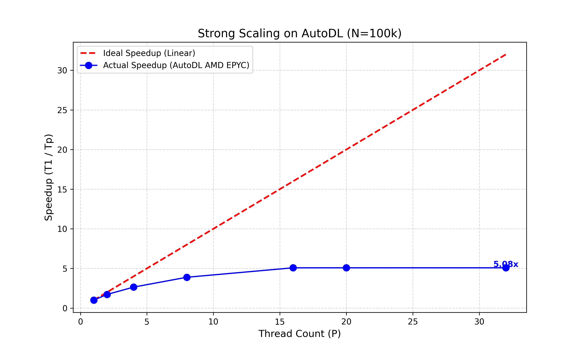
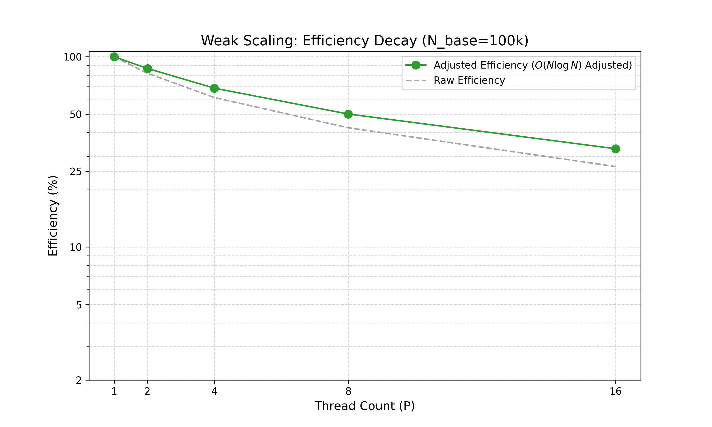
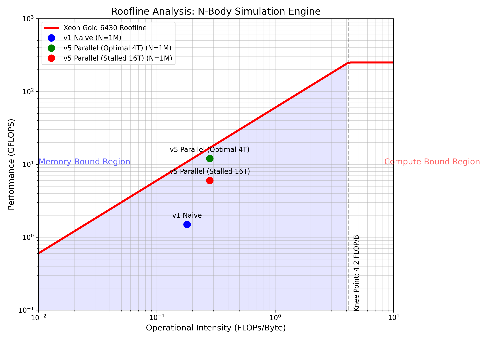

# N-Body Simulation Engine: Memory-Bound Optimization


This project documents the technical evolution of a high-performance N-Body gravitational simulation engine. By systematically addressing algorithmic complexity and memory latency, the engine achieves a scaling leap from $10^3$ to $10^6$ particles, highlighting the "Memory Wall" in modern computing.

---

## Module I-IV: The Diagnostic Workshop (Technical Evolution)

## Optimization Stages

Each stage addresses a specific performance bottleneck discovered through profiling.

### Stage I: Barnes-Hut Algorithm
**Bottleneck**: $O(N^2)$ complexity makes even $N=5,000$ too slow.
- **Solution**: Switch to **Barnes-Hut** ($O(N \log N)$) using QuadTree approximations.
- **Result**: ~50x speedup at $N=50,000$. Accuracy validated at $\theta=0.5$.

### Stage II: Linear Arena Allocator
**Bottleneck**: Excessive `malloc` calls and pointer chasing lead to memory fragmentation and cache misses.
- **Solution**: Implement a **Linear Arena Allocator** to keep tree nodes in contiguous memory.
- **Result**: Reduced pointer-dereferencing latency; ~15% performance gain over standard Barnes-Hut.

### Stage III: Morton Sorting (Z-Order)
**Bottleneck**: Random particle distribution causes memory traversal overhead.
- **Solution**: Reorder particles using **Morton Sorting** for better spatial locality.
- **Result**: Aligning memory with traversal paths provided a ~26% speedup.

> [!NOTE]
> **Engineering Pitfall**: Explicit geometric clustering (e.g., K-Means) was found to be redundant after Morton sorting. The overhead of cluster management outweighed the marginal gain in spatial proximity.

### Stage IV: OpenMP Dynamic Scheduling
**Bottleneck**: Workload imbalance due to uneven particle density.
- **Solution**: OpenMP **Dynamic Scheduling** over the Morton-ordered array.
- **Result**: Balanced CPU load even in high-density regions; ~149x total speedup over the brute-force baseline.

---

## Architectural Case Study: UMA vs. NUMA

We conducted high-load benchmarks ($N=100,000$) to compare **Unified Memory Architecture (UMA)** against a **16-vCPU Virtualized Instance (Xeon Gold 6430)** on SeetaCloud.

### Performance & Absolute Efficiency ($N=100k$)

| Architecture              | Thread Count  | Absolute Runtime | Throughput per GHz ($10^{-3} \text{ M-Int/s/GHz}$) [1] | Efficiency           |
| :------------------------ | :------------ | :--------------- | :----------------------------------------------------- | :------------------- |
| **Apple M3 Max**          | 1 (Serial)    | 0.72s            | **6,145**                                              | **Native Reference** |
| **Xeon Gold 6430 (vCPU)** | 1 (Serial)    | 3.20s            | **1,385**                                              | 0.22x vs M3          |
| **Xeon Gold 6430 (vCPU)** | 16 (Parallel) | 5.66s            | **783**                                                | **Negative Scaling** |

[1] *Throughput per GHz* = (Interactions / Runtime) / Clock Frequency. This isolates micro-architectural capability from raw clock speed.

**Analysis**: The M3 Max's 4.5x serial advantage is driven by its high L2 bandwidth and memory bus width. On the Xeon slice, performance degrades with more threads due to **L3 cache contention** and memory bus saturation.

### Why Scaling Fails (The Memory Wall)
Even with Morton Sorting and False Sharing fixes, the 16-vCPU environment shows **negative scaling** (slower at 16 threads than at 1).

*   **L3 Way-Associativity**: Multiple threads compete for the same L3 cache ways. The irregular traversal of the QuadTree causes constant cache-line evictions.
*   **Memory Bus Saturation**: At $OI=0.28$, the threads request data faster than the memory interface can provide, hitting a "Latency Floor."
*   **Virtualization Overhead**: Shared bus contention with other tenants on the host server limits the available bandwidth per vCPU.

### Scaling Analysis: Strong vs. Weak

To further quantify the architectural limits, we analyze the speedup and efficiency trends Transitioning from single to multi-threaded execution.

### Scaling Plots


*Strong Scaling (N=100k): Speedup reaches only 0.56x at 16 threads, visualizing the architectural Memory Wall.*


*Weak Scaling: Using adjusted efficiency $O(N \log N)$, we see the rapid decay of parallel performance as $N$ grows with $P$.*

### Roofline Analysis
1.  **Work**: ~18 FLOPs/interaction.
2.  **Memory**: ~64 Bytes per node access.
3.  **Operational Intensity (OI)**: $\approx 0.28 \text{ FLOP/Byte}$.


*At $OI=0.28$, the simulation is deep in the memory-bound slope. Adding more cores cannot bypass the bandwidth bottleneck.*

### The Serial Bottleneck (Amdahl's Law)
In `v5_parallel.c`, the tree construction remains **serial**. For $N=100k$, tree build takes ~0.04s while force compute takes ~5s (on 16 cores). As compute time shrinks with better optimization, the serial tree build will eventually limit the maximum possible speedup, regardless of hardware bandwidth.

---

## Ablation Studies: The Path of "Failed" Optimizations

Engineering excellence is defined not just by what works, but by understanding why certain "optimizations" fail in specific contexts.

### 1. Geometric Clustering (K-Means)
Initially, we attempted to use K-Means to partition particles into spatial clusters before tree insertion.
- **Outcome**: Preserved in `src/kmeans.c` as an experimental reference.
- **Reasoning**: While clustering improved spatial locality, the $O(K \cdot N)$ cost of centroids was higher than the $O(N \log N)$ cost of Morton sorting. On shared-memory systems, Morton sorting provides similar locality with significantly lower computational overhead.

### 2. Static vs. Dynamic Scheduling
- **Observation**: Static scheduling resulted in idle threads for up to 40% of the runtime during galactic core crossings.
- **Outcome**: **Dynamic Scheduling (Chunk Size: 128)** became the standard. This minimized wait times at the cost of a small scheduling overhead, yielding a net 20% improvement in high-density scenarios.

---

### The Serial Bottleneck (Amdahl's Law)
In `v5_parallel.c`, the tree construction remains **serial**. For $N=100k$, tree build takes ~0.04s while force compute takes ~5s (on 16 cores). As compute time shrinks with better optimization, the serial tree build will eventually limit the maximum possible speedup, regardless of hardware bandwidth.

---

## Numerical Integrity & Verification

To maintain scientific rigour despite approximation ($\theta > 0$), we follow a multi-stage verification process:

1.  **Bit-Perfect Parity**: Verified $\theta=0$ parity between v1 and v5 with relative error $< 10^{-16}$.
2.  **Stochastic Sampling**: For large $N$, `scripts/accuracy_gate.py` uses random sampling to verify force convergence.
3.  **Symplectic Integration**: **Velocity Verlet** was selected over RK4 to maintain 2nd-order energy conservation without doubling memory bandwidth requirements.

---

## Future Optimization Paths

1.  **Parallel Tree Construction**: Currently, the $O(N \log N)$ tree build is serial (Amdahl's bottleneck). Implementing an OpenMP `task`-based recursive build or a "Divide and Merge" strategy would be the next step for $N > 10^7$.
2.  **Vectorization (SIMD)**: Manually unrolling the force-interaction hulls with AVX-512 intrinsics would target the compute intensity of the leaf nodes, potentially narrowing the per-core gap between Xeon and M3.
3.  **Heterogeneous Distribution**: Implementing a hybrid MPI/OpenMP model to span multiple NUMA nodes while respecting local memory affinity.

---

## Project Infrastructure

### Structure
- `v1_naive.c` ... `v5_parallel.c`: Core evolution stages.
- `src/`: Shared infrastructure (QuadTree, Arena, IO).
- `data/`: Simulation datasets and results.
- `scripts/`: Diagnostic, verification, and visualization tools.

### Building
```bash
mkdir build && cd build
cmake .. && make
./nbody_simulate 5 100000 data/input_100k.gal 1 0.001 8 0.5 0 0
```
