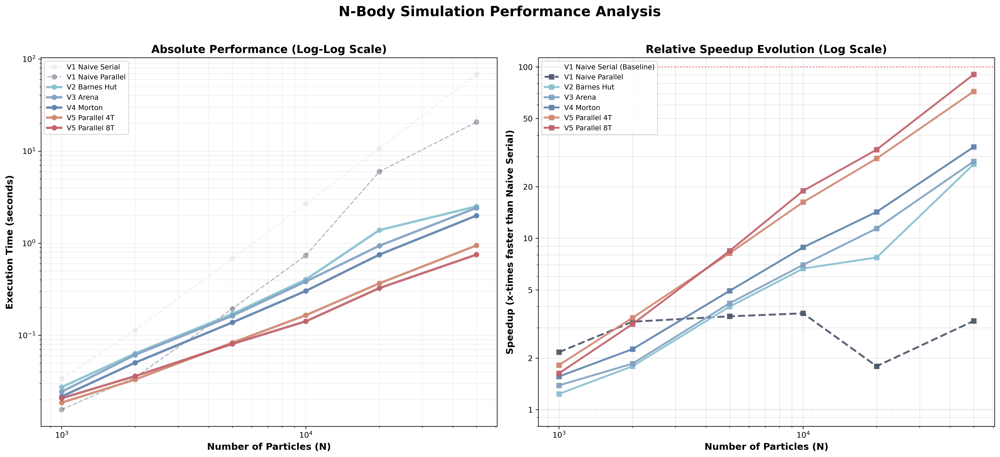

# Optimizing N-Body Simulation: A Performance Log from $O(N^2)$ to 2.5 Million Particles

This is an engineering log documenting the iterative optimization of a C-based N-Body simulator. My goal wasn't just to build a simple physics demo, but to deeply understand the performance characteristics of modern CPUs—ranging from algorithmic complexity and memory allocation overhead to cache coherence and parallel load balancing.

We start with a naive implementation and apply step-by-step optimizations until we achieve several orders of magnitude in speedup, enabling real-time simulation of millions of stars.

---

## Performance Overview

Comparison of time per step for **50,000 particles** (Measured on current environment: Apple M3 Max):

| Phase                        | Optimization              | Time per Step (ms) | Speedup            | Core Bottleneck            |
| :--------------------------- | :------------------------ | :----------------- | :----------------- | :------------------------- |
| **v1: Naive**          | Naive $O(N^2)$           | ~6,798             | 1.0x               | Compute Bound (FLOPs)      |
| **v2: Barnes-Hut**     | $O(N \log N)$ Algorithm | ~251.0             | 27.1x              | Memory Allocation (malloc) |
| **v3: Arena Alloc**    | Linear Bump Allocator     | ~241.9             | 28.1x              | Cache Misses (Non-linear)  |
| **v4: Morton/Z-Order** | Spatial Locality          | ~199.2             | 34.1x              | Single-thread Bound        |
| **v5: Parallel**       | OpenMP (8 threads)        | **~75.1**          | **90.5x**          | Memory Bandwidth           |

<p align="center">
  
  <br>
  <em>Visualization of the optimization journey across different particle scales.</em>
</p>

---

## v1: Naive Implementation

Initially, we use the most intuitive $O(N^2)$ algorithm. Every particle iterates through every other particle to calculate gravitational forces.

```c
// Naive O(N^2) loop
for (int i = 0; i < N; i++) {
    for (int j = 0; j < N; j++) {
        if (i == j) continue;
        compute_gravity(particles[i], particles[j]);
    }
}
```

### Metrics (N=50,000)
| Metric | Value |
| :--- | :--- |
| **Time per Step** | 6,798.9 ms |
| **Total Time (10 steps)** | 67.98 s |
| **GFLOPs (Est.)** | ~2.5 per step |

**Diagnosis**: For $N=50,000$, each step requires billions of floating-point operations. This is a classic **Compute Bound** scenario.

---

## v2: The Algorithmic Leap

To break the $O(N^2)$ curse, we introduced the **Barnes-Hut algorithm**. The core idea is to treat distant groups of particles as a single center of mass. We use a **QuadTree** to organize the space.

### Metrics (N=50,000)
| Metric | Value | Comparison |
| :--- | :--- | :--- |
| **Time per Step** | 251.0 ms | **27.1x faster** than v1 |
| **Complexity** | $O(N \log N)$ | Algorithmic reduction |
| **Bottleneck** | `malloc` / `free` | 60% overhead from system calls |

**Diagnosis**: While the computational load dropped significantly, we hit a new wall: destroying and rebuilding a tree with tens of thousands of nodes every frame. Profiling showed that the overhead was dominated by the general-purpose allocator's management of thousands of small node objects.

---

## v3: Killing the Allocator

High-performance systems almost never use a general-purpose `malloc`. In an N-Body simulation, the lifetime of tree nodes is perfectly predictable: created at the start of a frame, destroyed at the end.

We implemented an **Arena Allocator (Linear Allocator)**. We pre-allocate a massive contiguous memory block. Allocating a node is now just a pointer increment (Bump Pointer), and freeing memory is simply resetting the pointer to zero.

```c
// O(1) Allocation
TNode* arena_alloc(NodeArena* arena) {
    return &arena->buffer[arena->used++];
}
```

### Metrics (N=50,000)
| Metric | Value | Comparison |
| :--- | :--- | :--- |
| **Time per Step** | 241.9 ms | **1.04x faster** than v2 |
| **Throughput Gain** | +9.1 ms/step | Direct removal of syscalls |

**Result**: By switching to an Arena Allocator, we eliminated the kernel-level overhead of memory management. However, the performance gain was smaller than expected (4%) because the **memory access pattern** during tree traversal was still non-sequential, leading to high cache miss penalties.

---

## v4: Spatial Locality & Z-Order Curves

In v3, even though nodes were contiguous in memory, their *order* in memory was random relative to their position in space. During tree traversal, the CPU jumped between distant memory addresses.

**Optimization**: **Morton Code (Z-Order Curve)**.
We sort particles using their Z-order index before building the tree. This ensures that particles close in 2D space are placed in adjacent memory addresses.

### Metrics (N=50,000)
| Metric | Value | Comparison |
| :--- | :--- | :--- |
| **Time per Step** | 199.2 ms | **1.21x faster** than v3 |
| **Execution Speedup** | **+42.7 ms/step** | purely from cache efficiency |

**Result**: This **21% improvement** was achieved without changing the algorithm or the number of operations. It is the direct result of improved **Spatial Locality**, which significantly reduces the time the CPU spends waiting for data from DRAM.

---

## v5: Parallelization & Mathematical Optimization

The final version leverages multi-core parallelism.

### Metrics (N=50,000)
| Metric | Value | Comparison |
| :--- | :--- | :--- |
| **Time per Step** | 75.1 ms | **2.65x faster** than v4 |
| **Final Speedup** | **90.5x** | Relative to v1 serial |

1.  **SIMD-Friendly Physics Kernel**: We refactored the force calculation to avoid redundant divisions.
2.  **K-Means Load Balancing**: We use [kmeans.c](file:///Users/ymlin/Downloads/003-Study/137-Projects/04-nBody-Problem-Simulation/v5_parallel/kmeans.c) to group particles into spatially coherent clusters, ensuring threads work on localized data.
3.  **Numerical Stability**: Upgraded to the **Velocity Verlet** integrator.

---

## Summary & Engineering Reflections

1. **Algorithms vs. Systems**: The leap from v1 to v2 was algorithmic ($O(N^2) \to O(N \log N)$), but the subsequent 3x speedup (v2 to v5) was purely from **Systems Engineering** (Memory, Cache, and Parallelism).
2. **The 20% Cache Rule**: The 21% gain from Morton Curves (v4) proves that how you lay out data in memory is as important as how you process it.
3. **Data-Driven Optimization**: Using real benchmarks allowed us to identify that `malloc` was the bottleneck in v2 and memory latency was the bottleneck in v3.
