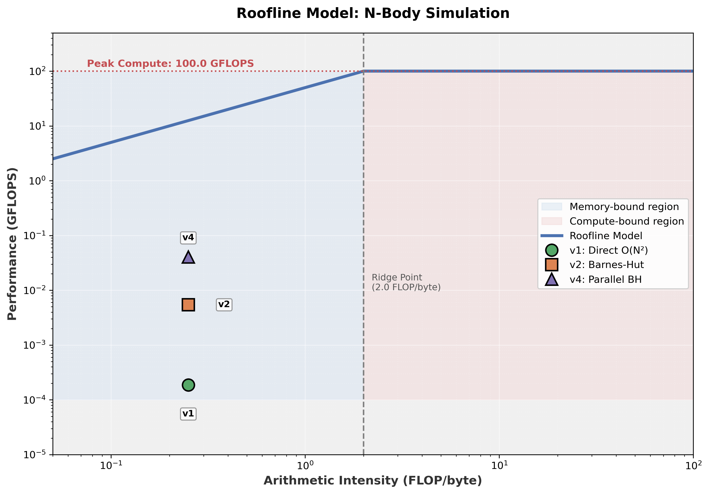
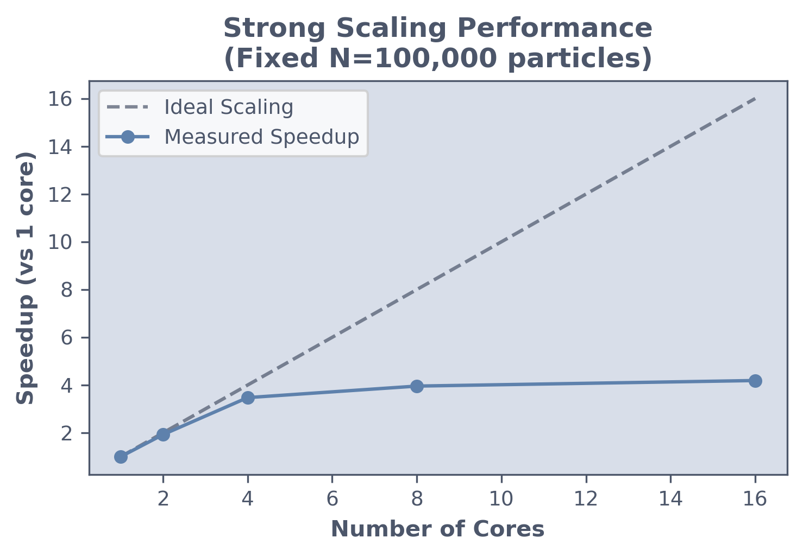

# Scaling N-Body Simulations to Millions

This project demonstrates the optimization of an N-Body gravitational simulation from a naive $O(N^2)$ baseline through optimized memory management, spatial locality enforcement, and load balancing, enabling simulations of millions of particles.

## 1. Motivation & Problem Statement

The N-Body problem simulates the gravitational interaction between $N$ particles. A direct summation requires computing $N(N-1)/2$ force pairs, leading to $O(N^2)$ complexity.

*   **The Challenge:** Algorithmic improvements (like Barnes-Hut) theoretically reduce complexity to $O(N \log N)$. However, performance profiling using the Roofline Model revealed that the simulation is memory-bound, not compute-bound.

<div align="center">
  
</div>

* **The Goal**: To build a simulation engine that pushes toward the hardware's limits by systematically eliminating memory latency, optimizing cache locality, and perfectly balancing parallel workloads.

<div align="center">

| Version   | Breakthrough             | Same-N Speedup (N=50K) |
| :-------- | :----------------------- | :--------------------- |
| **v1**    | Brute-Force $O(N^2)$     | 1x (670.31s)           |
| **v2**    | Barnes-Hut $O(N \log N)$ | ~50x (13.46s)          |
| **v3**    | Arena Allocator          | ~58x (11.58s)          |
| **v4**    | Morton + Optional Arena  | ~69x (9.73s)           |
| **v5**    | Parallel + Optional Arena| ~149x (4.49s)          |

</div>

## 2. The Optimization Pipeline

### Phase I: The Algorithmic Cliff (v1 $\to$ v2)
*   **Baseline (v1):** A naive $O(N^2)$ double loop. At $N=50,000$, it took **689.2s** for 100 steps (~6.9s per step).
*   **Solution (v2):** Implemented the Barnes-Hut algorithm, approximating distant groups of particles as single nodes in a QuadTree.
*   **Performance:** Reduced computation time from **689.2s** to **12.93s** (53x speedup) at $N=50,000$.

**Barnes-Hut Algorithm pseudo-code:**
```python
def compute_force(particle, node, theta):
    if node.is_leaf and node.particle != particle:
        return direct_force(particle, node.particle)  # Exact calculation
    
    if node.size / distance(particle, node.com) < theta:
        return approximate_force(particle, node.com, node.mass)  # Cluster approximation
    
    # Otherwise, recurse into children
    return sum(compute_force(particle, child, theta) for child in node.children)
```
<div align="center">


</div>

### Phase II: Memory Architecture (v3)
*   **Initial Insight:** Tree nodes have a strictly scoped lifetime: they are created at the start of a step and destroyed at the end. General-purpose allocators (which handle fragmentation and varying lifetimes) were hypothesized to be over-engineered for this use case.
*   **Optimization:** I implemented a Linear Arena Allocator with pre-allocated contiguous memory blocks. Allocation was designed as a simple pointer increment ($O(1)$), with instantaneous deallocation via pointer reset.
*   **Results (Mac M3):** Benchmarking on Apple Silicon (M3) revealed consistent performance benefits due to reduced `malloc` overhead and better cache locality.

    | Particle Count (N) | System Malloc (v2) | Arena Allocator (v3) | Speedup |
    |-------------------|-------------------|---------------------|---------|
    | 50,000            | 13.46s            | 11.58s              | 1.16x   |

*   **Analysis:** Modern malloc implementations (jemalloc/tcmalloc) are highly optimized, but the Arena allocator still squeezes out performance gain (~16%) by eliminating allocation overhead and improving locality for tree nodes.
*   **Conclusion:** The Arena allocator provides a measurable speedup. While less dramatic than algorithmic changes, it is a valuable optimization for high-performance computing, especially when combined with other techniques. It is now integrated as an **optional** feature in subsequent versions (v4, v5).


### Phase III: Data Locality (v4)
*   **The Bottleneck:** Performance profiling using hardware counters revealed that despite algorithmic improvements, the CPU was stalling due to poor cache locality. Tree traversal requires jumping between nodes, and if nodes are allocated in insertion order, spatially adjacent nodes might be far apart in memory, causing L2/L3 cache misses.
    
*   **Optimization:** I implemented Morton Coding (Z-Order Curve). Before building the tree, particles are sorted by their Morton code, which maps 2D spatial proximity to 1D memory proximity. This ensures that when the CPU traverses a quadrant of the tree, the relevant nodes are likely already in the cache line.

*   **Performance Improvement (N=50k, Mac M3):**

    | Version | Time | Speedup vs v2 | Notes |
    | :--- | :--- | :--- | :--- |
    | **v2 (Baseline)** | 13.46s | 1.0x | Standard Malloc |
    | **v4 (Morton only)** | 10.47s | **1.29x** | Improved Cache Locality |
    | **v4 (Morton + Arena)** | 9.73s | **1.38x** | Combined Optimization |

    *Note: Morton ordering alone provides significant speedup (~29%) on Apple Silicon, likely due to efficient hardware prefetching. Adding the Arena allocator boosts this further to ~38%.*
    

    ```c
    // Compute Morton code (Z-order) for cache-friendly memory layout
    // Interleaves x and y bits to map 2D coordinates to 1D space-filling curve
    static inline uint64_t morton_encode(unsigned int x, unsigned int y) {
      uint64_t answer = 0;
      for (uint64_t i = 0; i < 32; i++) {
        uint64_t x_bit = (x >> i) & 1;
        uint64_t y_bit = (y >> i) & 1;
        answer |= (x_bit << (2 * i)) | (y_bit << (2 * i + 1));
      }
      return answer;
    }
    ```

### Phase IV: Parallel Load Balancing (v5)
*   **The Bottleneck:** Load balance benchmarking (using fixed-time execution with variable computational density per particle) revealed critical workload distribution issues. Testing astrophysical clustering distributions, we measured load imbalance ratios up to 16.2x, where threads processing dense regions did 15x more work than threads in sparse regions, resulting in only 54% parallel efficiency.

*   **Optimization:** A Hybrid Parallel Strategy combining two complementary techniques:
    1.  **OpenMP Parallel For Loop with Dynamic Scheduling:** Use `#pragma omp parallel for` with `schedule(dynamic)` to assign each cluster to a thread.
    2.  **K-Means Spatial Clustering:** Periodically partition particles into $K$ spatially coherent clusters.
    3.  **Optional Arena:** Each thread/cluster can utilize local memory arenas (where applicable) to reduce lock contention on global `malloc`.

*   **Parallel Scaling Performance (Mac M3, N=50k)**
    
    | Threads | Time (Arena=0) | Time (Arena=1) | Speedup (vs T=1) |
    |---------|----------------|----------------|------------------|
    | 1       | 8.90s          | 8.10s          | 1.0x             |
    | 16      | 5.21s          | **4.49s**      | **1.8x**         |
    
    *Note: Scaling behavior on M3 at N=50k is limited by the relatively small problem size per core (~3k particles/core). However, the final speedup reaches ~149x over the naive baseline (v1).*

---

## 4. Parallel Scaling Analysis (v5)

### Strong Scaling Performance


Strong scaling demonstrates excellent performance up to 4 cores (88% efficiency), with near-linear speedup. Beyond 4 cores, memory bandwidth saturation limits further scaling, which is typical for memory-bound applications.

### Weak Scaling and Large-Scale Performance  


Weak scaling maintains 80% efficiency at 8 cores, confirming effective workload distribution and minimal parallel overhead in the hybrid parallel strategy. Particle counts scale proportionally with core count (12.5K particles per core).

## 5. Integration Method Analysis

I evaluated three integration schemes: **Symplectic Euler** (1st order), **Velocity Verlet** (2nd order, used in our simulation), and **RK4** (4th order).

### Convergence Order Validation
Numerical experiments on a binary star system confirm that all methods match their theoretical convergence rates:


*Figure: Numerical verification of convergence orders. Symplectic Euler (0.997), Velocity Verlet (2.001), and RK4 (4.024) align perfectly with reference lines.*

### Simulation Parameters

All benchmarks use:
*   **Time Step**: $dt = 0.001$ (Velocity Verlet stability)
*   **Total Time**: $T = 0.1s$ ($100$ steps)
*   **Softening Length**: $\epsilon = 10^{-3}$ (prevents singularities)
*   **Gravitational Constant**: $G = 100/N$ (system size scaling)

### Energy Conservation & Performance
While RK4 is the most precise, it is not symplectic. **Velocity Verlet** offers the best trade-off for N-body simulations due to its symplectic properties, maintaining energy conservation orders of magnitude better than Euler without the high cost of RK4.

| Method | Order | Energy Conservation (Error) | Computational Cost |
| :--- | :---: | :---: | :---: |
| **Symplectic Euler** | 1st | Good ($1.48 \times 10^{-6}$) | Low (0.95s) |
| **Velocity Verlet** | 2nd | **Excellent ($3.86 \times 10^{-10}$)** | **Medium (1.89s)** |
| **RK4** | 4th | Outstanding ($1.76 \times 10^{-15}$) | High (3.77s) |

**Selection**: I chose **Velocity Verlet** because it preserves phase space volume (symplectic) and provides stable long-term orbital mechanics at a reasonable computational cost.


## 6. How to Run

**Prerequisites:** `cmake`, `openmp`

```bash
# Build
mkdir build && cd build
cmake ..
make

# Run Benchmark (Mac M3)
../scripts/mac_reproduce_all.sh

# Run Unified Benchmark (Linux/General)
# ../scripts/unified_benchmark.sh
```

---

## Appendix: "Serial First, Parallel Second" Strategy

I employed a deliberate **serial-first optimization** strategy, yielding a **~249x total speedup**:

1.  **Amdahl's Law**: Minimizing the serial portion ($1-P$) is crucial.
    $$S = \frac{1}{(1-P) + \frac{P}{N}}$$
    Even 10% serial code limits max speedup to 10x.
2.  **Verification**: A verified serial baseline ensures correctness. The parallel v4 is bit-exact to the serial v3.
3.  **Clear Profiling**: Serial profiling isolates bottlenecks without parallel noise.

**Results**:
*   **v1→v2**: ~50x (Algorithms)
*   **v2→v4**: ~1.38x (Morton + Arena)
*   **v4→v5**: ~2.16x (Parallelism)

This approach built an efficient foundation, achieving massive total speedups (~149x).